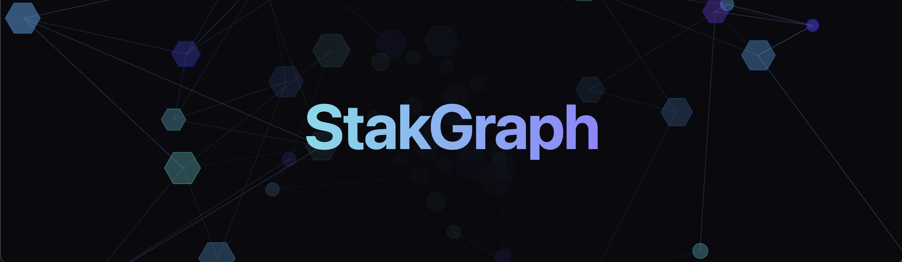

# stakgraph

A source code parser using treesitter, LSP, and neo4j. Source code knowledge graphs for AI agents.



### parse a repo

Example of parsing [sphinx-tribes](https://github.com/stakwork/sphinx-tribes) and [sphinx-tribes-frontend](https://github.com/stakwork/sphinx-tribes-frontend). Endpoints, Requests, and E2E tests are linked between the two repos.

```bash
export REPO_URLS="https://github.com/stakwork/sphinx-tribes.git,https://github.com/stakwork/sphinx-tribes-frontend.git"
cargo run --bin urls
```

### language support

- [x] Golang
- [x] React
- [x] Ruby on Rails
- [x] Typescript
- [x] Python
- [ ] Swift
- [ ] Kotlin
- [ ] Rust
- [ ] Java

### LSP

This project uses the Language Server Protocol to connect nodes in the graph.

##### go

`go install golang.org/x/tools/gopls@latest`

##### rust

https://github.com/rust-lang/rust-analyzer/releases

##### typescript

`npm install -g typescript-language-server`

##### python

`pip install python-lsp-server`
