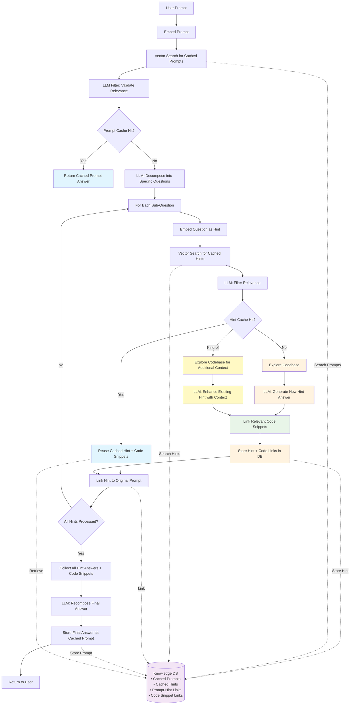

```mermaid

flowchart TD
A[User Prompt] --> B[Embed Prompt]
B --> C[Vector Search for Cached Prompts]
C --> D[LLM Filter: Validate Relevance]

    D --> E{Prompt Cache Hit?}

    E -->|Yes| F[Return Cached Prompt Answer]
    E -->|No| G[LLM: Decompose into Specific Questions]

    G --> H[For Each Sub-Question]
    H --> I[Embed Question as Hint]
    I --> J[Vector Search for Cached Hints]
    J --> K[LLM: Filter Relevance]

    K --> L{Hint Cache Hit?}

    L -->|Yes| M[Reuse Cached Hint + Code Snippets]
    L -->|Kind-of| N2[Explore Codebase for Additional Context]
    L -->|No| N[Explore Codebase]
    N --> P[LLM: Generate New Hint Answer]

    P --> Q[Link Relevant Code Snippets]
    Q --> R[Store Hint + Code Links in DB]

    N2 --> P2[LLM: Enhance Existing Hint with Context]
    P2 --> Q

    M --> S[Link Hint to Original Prompt]
    R --> S

    S --> T{All Hints Processed?}
    T -->|No| H
    T -->|Yes| U[Collect All Hint Answers + Code Snippets]

    U --> V[LLM: Recompose Final Answer]
    V --> W[Store Final Answer as Cached Prompt]
    W --> X[Return to User]

    %% Database connections
    R -.->|Store Hint| Y[(Knowledge DB<br/>• Cached Prompts<br/>• Cached Hints<br/>• Prompt-Hint Links<br/>• Code Snippet Links)]
    C -.->|Search Prompts| Y
    J -.->|Search Hints| Y
    S -.->|Link| Y
    W -.->|Store Prompt| Y
    M -.->|Retrieve| Y

    %% Styling
    classDef cacheHit fill:#e1f5fe
    classDef cacheMiss fill:#fff3e0
    classDef partialHit fill:#fff9c4
    classDef database fill:#f3e5f5
    classDef codeLink fill:#e8f5e8

    class F,M cacheHit
    class N,P,Q,R cacheMiss
    class N2,P2 partialHit
    class Y database
    class Q codeLink

```
